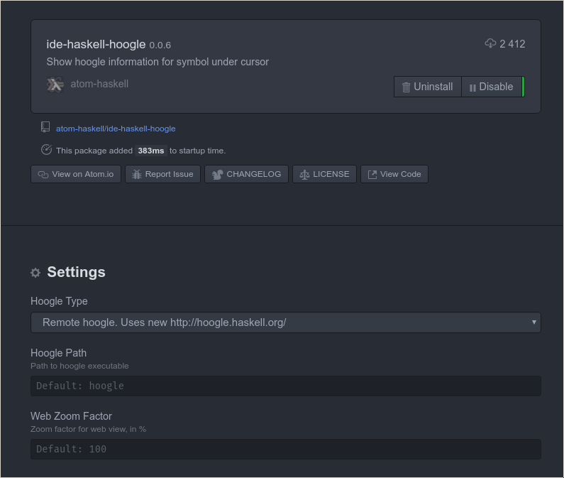

Install package `ide-haskell-hoogle`. Refer to [Atom Flight Manual](http://flight-manual.atom.io/using-atom/sections/atom-packages/) for details on installing packages.

Package supports using either local Hoogle database, or remote one (hosted on <https://haskell.org/hoogle/> and/or <http://hoogle.haskell.org/>)

- **Local database** requires `hoogle` executable, plus you will need to build hoogle database for hoogle itself to work.
- **Remote database** obviously requires connection to the Internet

## Choosing remote or local database

By default, package uses "new" remote database from <http://hoogle.haskell.org/>. You can change that using **Hoogle Type** setting:



## Setup for local database

### Install `hoogle`

You can use `cabal`, `stack`, or your favorite package manager.

Cabal:
```
cabal install hoogle
```

Stack:
```
stack install hoogle
```

### Build local hoogle database

You can use either hoogle-4 or hoogle-5, either of these versions will work. However, hoogle-5 is recommended.

If not sure what hoogle version you have, run
`hoogle --version`.

You should get output similar to this:

```
$ hoogle --version
Hoogle 5.0.12, http://hoogle.haskell.org/
```

or

```
$ hoogle --version
Hoogle v4.2.43, (C) Neil Mitchell 2004-2012
http://haskell.org/hoogle
```

#### Hoogle v4

You have a choice between installing basic database and extended database.

{}
Installing extended database will take a lot of time and memory!
{}

To install basic database, run
```
hoogle data
```

To install extended database, run
```
hoogle data all
```

#### Hoogle v5

Run

```
hoogle generate --download
```

This will get you the database used on <http://haskell.org/hoogle>

### Point the package to `hoogle` executable

{}
You don't need to do this if `hoogle` is in `PATH`, i.e. if you can type `hoogle` in the terminal, and won't get 'File not found' error.
{}

Open Atom's settings, Packages, find ide-haskell-hoogle, then set **Hoogle Path** to full path to `hoogle` executable. For example, if your `hoogle` executable is located in `/home/user/.local/bin/` directory, put `/home/user/.local/bin/hoogle` into **Hoogle Path**.
